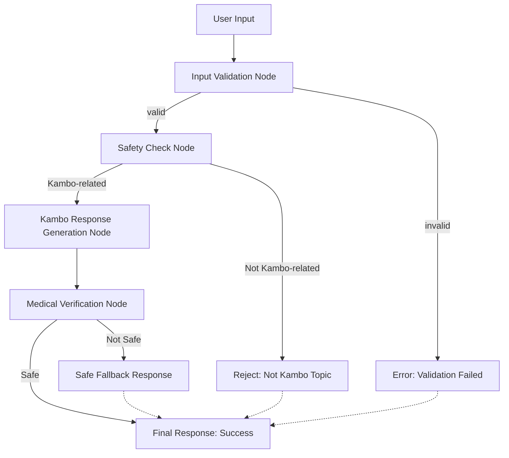

# Kambo Chatbot

A multi-agent chatbot system for providing information about Kambo ceremonies and traditional practices, built with LangChain and explicit graph patterns.

## Features

- **Explicit Graph Architecture**: Clear, visible data flow using LangChain's RunnableSequence
- **Multi-Node Processing**: Specialized nodes for different tasks with explicit routing
- **RAG System**: Knowledge base for accurate information retrieval
- **Medical Verification**: Ensures responses don't contain medical advice
- **Security**: Input validation and prompt injection protection
- **Compliance**: Built-in medical disclaimers and safety measures
- **Database**: Conversation logging and security event tracking
- **LangChain Integration**: Modern LLM orchestration framework
- **Azure Key Vault**: Secure secret management for production

## Architecture

### Explicit Graph Pattern
The system uses LangChain's explicit graph pattern with clear nodes and edges:

```
User Input
    ↓
1. Input Validation Node
    ↓ (Edge: validation result)
2. Safety Check Node (Kambo classification)
    ↓ (Edge: topic relevance)
3. Kambo Response Generation Node
    ↓ (Edge: response quality)
4. Medical Verification Node
    ↓ (Edge: safety verification)
5. Final Response Routing
```

#### Mermaid Diagram


### Nodes
1. **Input Validation Node**: Validates and sanitizes user input
2. **Safety Check Node**: Classifies if question is Kambo-related
3. **Kambo Response Node**: Generates educational responses about Kambo
4. **Medical Verification Node**: Ensures responses don't contain medical advice

### Edges
- **Validation Edge**: Routes based on input validation result
- **Topic Edge**: Routes based on whether question is Kambo-related
- **Safety Edge**: Routes based on medical verification result

### Components
- **ExplicitGraphCoordinator**: Main orchestrator using RunnableSequence
- **Knowledge Base**: Manages RAG data sources
- **Input Validator**: Security and input validation
- **Database**: SQLAlchemy models for data persistence
- **Key Vault Manager**: Secure secret management

## Setup

### Prerequisites

1. **Install uv** (recommended package manager):
```bash
# On Windows (PowerShell)
powershell -c "irm https://astral.sh/uv/install.ps1 | iex"

# On macOS/Linux
curl -LsSf https://astral.sh/uv/install.sh | sh
```

2. **Install Python 3.11+** (if not already installed)

### Migration from pip to uv

If you're migrating from an existing pip-based setup:

1. **Run the migration script**:
```bash
python migrate_to_uv.py
```

2. **Follow the instructions** provided by the migration script

3. **Clean up old files** (optional):
```bash
# Remove old virtual environment
rm -rf venv/ .venv/ env/

# Remove old requirements.txt (backup created automatically)
rm requirements.txt
```

### Local Development

1. **Clone the repository**:
```bash
git clone <your-repo-url>
cd kambo_chatbot
```

2. **Install dependencies with uv**:
```bash
# Install all dependencies
uv sync

# Or install with development dependencies
uv sync --dev

# Or install with optional dependencies
uv sync --all-extras
```

3. **Set up Azure Key Vault** (recommended) or use environment variables:
```bash
# Option A: Use Key Vault (recommended for production)
export AZURE_KEY_VAULT_URL=https://your-vault.vault.azure.net/

# Option B: Use environment variables (for development)
export OPENAI_API_KEY=your_openai_api_key_here
export SECRET_KEY=your_secret_key_here
```

4. **Run the application**:
```bash
uv run python main.py
```

5. **Access the API**:
- API Documentation: http://localhost:8000/docs
- Health Check: http://localhost:8000/health

### Alternative: Using uv with virtual environment

If you prefer to work with a virtual environment:

```bash
# Create and activate virtual environment
uv venv
source .venv/bin/activate  # On Windows: .venv\Scripts\activate

# Install dependencies
uv pip install -e .

# Run the application
python main.py
```

### Key Vault Setup

For production deployment, use Azure Key Vault for secure secret management:

1. **Test Key Vault setup:**
```bash
uv run python setup_key_vault.py
```

2. **Follow the detailed setup guide:**
See [KEY_VAULT_SETUP.md](KEY_VAULT_SETUP.md) for complete instructions.

## Deployment

### Azure App Service Deployment

This application is configured for deployment to Azure App Services using GitHub Actions with Key Vault integration.

#### Quick Deploy

1. **Fork/Clone** this repository to your GitHub account
2. **Create Azure Key Vault** and add secrets (see [KEY_VAULT_SETUP.md](KEY_VAULT_SETUP.md))
3. **Create Azure App Service** (Python 3.11 runtime)
4. **Configure Environment Variables** in Azure Portal
5. **Add GitHub Secret** `AZURE_WEBAPP_PUBLISH_PROFILE`
6. **Push to main branch** - automatic deployment will trigger

#### Environment Variables Required

Set these in Azure App Service Configuration:

```
# Required for Key Vault
AZURE_KEY_VAULT_URL=https://your-vault.vault.azure.net/

# Optional (for fallback)
OPENAI_MODEL=gpt-4
DATABASE_URL=sqlite:///./kambo_chatbot.db
APP_NAME=Kambo Chatbot
DEBUG=False
LOG_LEVEL=INFO
HOST=0.0.0.0
PORT=8000
```

#### Deployment Files

- `.github/workflows/azure-deploy.yml` - GitHub Actions workflow
- `startup.sh` - Azure App Service startup script
- `web.config` - IIS configuration for Windows hosting
- `runtime.txt` - Python version specification
- `azure.yaml` - Azure App Service configuration

For detailed deployment instructions, see [DEPLOYMENT.md](DEPLOYMENT.md).

## Testing

### Test the Explicit Graph
```bash
uv run python test_explicit_graph.py
```

### Test the API
```bash
uv run python test_api.py
```

### Test LangChain Components
```bash
uv run python test_langchain.py
```

### Test Key Vault Integration
```bash
uv run python setup_key_vault.py
```

## API Usage

### Chat Endpoint
```bash
curl -X POST "http://localhost:8000/chat" \
     -H "Content-Type: application/json" \
     -d '{"message": "What is Kambo?", "user_id": "user123"}'
```

### Response Format
```json
{
  "success": true,
  "response": "Kambo is a traditional Amazonian medicine...",
  "conversation_id": "uuid",
  "metadata": {
    "medical_verification": "passed",
    "topic_check": "passed",
    "model": "gpt-4"
  }
}
```

## Development

- Follow the coding standards in `.cursor/cursor.json`
- Write tests for all new functionality
- Maintain security best practices
- Always include medical disclaimers
- Use explicit graph patterns for complex workflows
- Use Key Vault for secret management in production

## Safety & Compliance

- All responses include medical disclaimers
- No medical advice is provided
- Users are directed to qualified healthcare providers
- Input validation prevents malicious content
- Comprehensive logging for audit trails
- Medical verification ensures safety
- Azure Key Vault provides HIPAA-compliant secret management

## Technical Details

### LangChain Integration
- Uses `RunnableSequence` for explicit graph construction
- `RunnablePassthrough` for data flow between nodes
- Async processing with `ainvoke`
- Structured output parsing

### Security Features
- **Azure Key Vault**: Encrypted secret storage
- **Managed Identity**: Secure authentication
- **Input Validation**: XSS and injection protection
- **Audit Logging**: Complete access tracking

### Graph Benefits
- **Visibility**: Clear data flow and routing logic
- **Debugging**: Easy to trace execution path
- **Maintainability**: Modular node structure
- **Scalability**: Easy to add new nodes and edges
- **Testing**: Each node can be tested independently

## Next Steps

1. **Deploy to Azure**: Use the provided deployment configuration
2. **Set up Key Vault**: Follow the security setup guide
3. **Add Monitoring**: Configure Application Insights
4. **Enhance RAG**: Add vector search and document processing
5. **Add Authentication**: User management system
6. **Graph Visualization**: Add tools to visualize the execution graph 