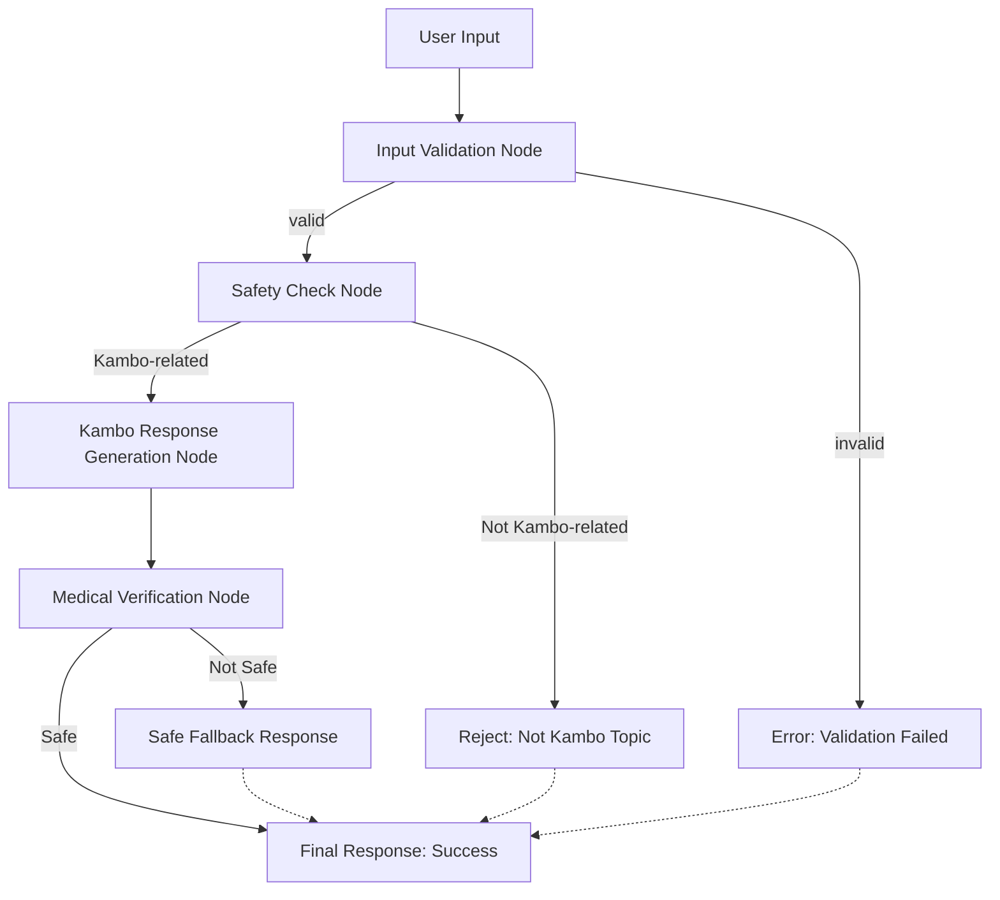

# Kambo Chatbot

A multi-agent chatbot system for providing information about Kambo ceremonies and traditional practices, built with LangChain and explicit graph patterns.

## Features

- **Explicit Graph Architecture**: Clear, visible data flow using LangChain's RunnableSequence
- **Multi-Node Processing**: Specialized nodes for different tasks with explicit routing
- **RAG System**: Knowledge base for accurate information retrieval
- **Medical Verification**: Ensures responses don't contain medical advice
- **Security**: Input validation and prompt injection protection
- **Compliance**: Built-in medical disclaimers and safety measures
- **Database**: Conversation logging and security event tracking
- **LangChain Integration**: Modern LLM orchestration framework

## Architecture

### Explicit Graph Pattern
The system uses LangChain's explicit graph pattern with clear nodes and edges:

```
User Input
    ↓
1. Input Validation Node
    ↓ (Edge: validation result)
2. Safety Check Node (Kambo classification)
    ↓ (Edge: topic relevance)
3. Kambo Response Generation Node
    ↓ (Edge: response quality)
4. Medical Verification Node
    ↓ (Edge: safety verification)
5. Final Response Routing
```

#### Mermaid Diagram


### Nodes
1. **Input Validation Node**: Validates and sanitizes user input
2. **Safety Check Node**: Classifies if question is Kambo-related
3. **Kambo Response Node**: Generates educational responses about Kambo
4. **Medical Verification Node**: Ensures responses don't contain medical advice

### Edges
- **Validation Edge**: Routes based on input validation result
- **Topic Edge**: Routes based on whether question is Kambo-related
- **Safety Edge**: Routes based on medical verification result

### Components
- **ExplicitGraphCoordinator**: Main orchestrator using RunnableSequence
- **Knowledge Base**: Manages RAG data sources
- **Input Validator**: Security and input validation
- **Database**: SQLAlchemy models for data persistence

## Setup

1. Install dependencies:
```bash
pip install -r requirements.txt
```

2. Create `.env` file:
```bash
cp .env.example .env
# Edit .env with your actual values
```

3. Run the application:
```bash
python main.py
```

4. Access the API:
- API Documentation: http://localhost:8000/docs
- Health Check: http://localhost:8000/health

## Testing

### Test the Explicit Graph
```bash
python test_explicit_graph.py
```

### Test the API
```bash
python test_api.py
```

### Test LangChain Components
```bash
python test_langchain.py
```

## API Usage

### Chat Endpoint
```bash
curl -X POST "http://localhost:8000/chat" \
     -H "Content-Type: application/json" \
     -d '{"message": "What is Kambo?", "user_id": "user123"}'
```

### Response Format
```json
{
  "success": true,
  "response": "Kambo is a traditional Amazonian medicine...",
  "conversation_id": "uuid",
  "metadata": {
    "medical_verification": "passed",
    "topic_check": "passed",
    "model": "gpt-4"
  }
}
```

## Development

- Follow the coding standards in `.cursor/cursor.json`
- Write tests for all new functionality
- Maintain security best practices
- Always include medical disclaimers
- Use explicit graph patterns for complex workflows

## Safety & Compliance

- All responses include medical disclaimers
- No medical advice is provided
- Users are directed to qualified healthcare providers
- Input validation prevents malicious content
- Comprehensive logging for audit trails
- Medical verification ensures safety

## Technical Details

### LangChain Integration
- Uses `RunnableSequence` for explicit graph construction
- `RunnablePassthrough` for data flow between nodes
- Async processing with `ainvoke`
- Structured output parsing

### Graph Benefits
- **Visibility**: Clear data flow and routing logic
- **Debugging**: Easy to trace execution path
- **Maintainability**: Modular node structure
- **Scalability**: Easy to add new nodes and edges
- **Testing**: Each node can be tested independently

## Next Steps

1. **Add OpenAI Integration**: Implement actual LLM responses
2. **Enhance RAG**: Add vector search and document processing
3. **Add Authentication**: User management system
4. **Deploy**: Choose hosting platform (Azure, Vercel, etc.)
5. **Monitoring**: Add analytics and monitoring
6. **Graph Visualization**: Add tools to visualize the execution graph 